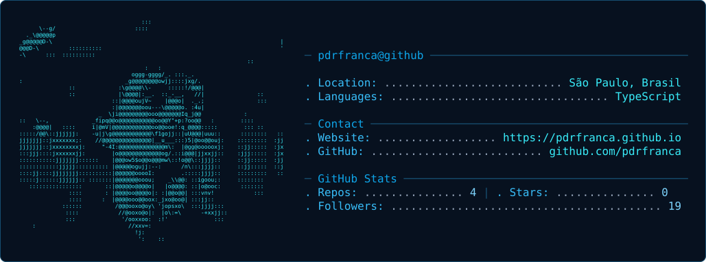

<picture>
  
</picture>

 

  

<h2 align="center">
  Front-end Developer ·
  React ·
  Next.js ·
  TypeScript
</h2>

  <strong>Transformando ideias em interfaces digitais modernas, acessíveis e performáticas.</strong>

  
  
  

 

## 🔷 Sobre mim

Sou **Pedro França**, estudante de **Análise e Desenvolvimento de Sistemas** e desenvolvedor com foco em **Front-end**.

Gosto de transformar ideias em produtos digitais que combinam **design, tecnologia e experiência do usuário**.

Atualmente, meu foco está em construir projetos que demonstrem não apenas conhecimento de tecnologia, mas também capacidade de **resolver problemas, tomar decisões de produto e entregar interfaces bem estruturadas**.

 

## 🔷 Projetos

  

 

## 🔷 GitHub

  

 

## 🔷 Vamos conversar?

Estou aberto a **oportunidades, projetos e conexões** com pessoas da área de tecnologia.

 

  

